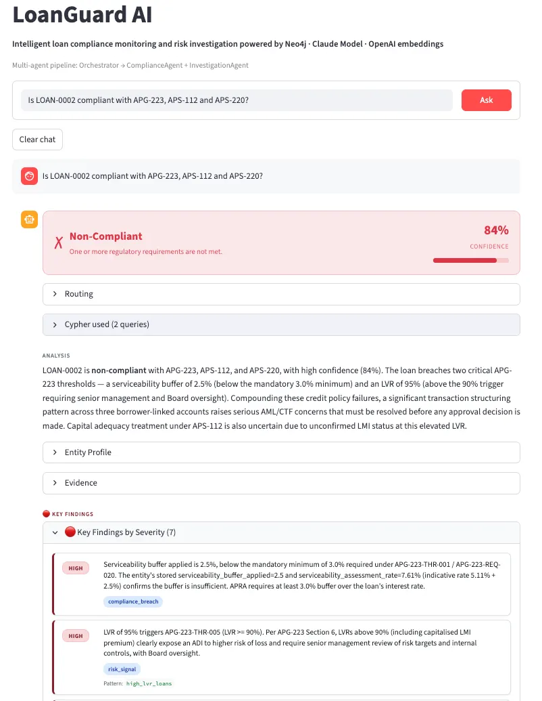

# LoanGuard AI

**Intelligent loan compliance monitoring and risk investigation powered by Neo4j, Claude, and OpenAI Embeddings**



LoanGuard AI is an agentic AI system for Australian financial services compliance. It checks whether loan applications and borrowers comply with APRA prudential standards (APS-112, APG-223, APS-220) and surfaces financial crime risk signals — all via natural-language questions answered by a multi-agent AI pipeline backed by a three-layer Neo4j knowledge graph.

The system is designed for compliance officers and risk analysts who need explainable, evidence-backed verdicts rather than black-box scores. Every compliance decision is persisted to the graph with full reasoning chains, cited regulatory sections, and semantic evidence — enabling complete audit trails and interactive evidence tracing in the Streamlit dashboard.

---

## How It Works

LoanGuard AI organises all knowledge across three graph layers and routes every user question through a coordinated agent pipeline.

### Three-Layer Knowledge Graph

| Layer | Description | Key Nodes |
|---|---|---|
| **1 - Entity** | Financial entities: borrowers, loans, accounts, transactions, collateral, officers | `Borrower`, `LoanApplication`, `BankAccount`, `Transaction`, `Collateral`, `Officer`, `Jurisdiction`, `Industry` |
| **2 - Regulatory** | APRA prudential standards parsed from source PDFs, chunked and embedded for semantic search | `Regulation`, `Section`, `Requirement`, `Threshold`, `Chunk` |
| **3 - Assessment** | Runtime compliance results written by agents during query processing | `Assessment`, `Finding`, `ReasoningStep` |

The `Jurisdiction` node bridges Layers 1 and 2. Borrowers link to jurisdictions via `RESIDES_IN` or `REGISTERED_IN`; regulations declare which jurisdictions they govern via `APPLIES_TO_JURISDICTION`. All APRA regulations point to `JUR-AU-FED`.

### Agent Pipeline

```
User question
    → Orchestrator.run()          (intent routing via Claude)
    → ComplianceAgent.run()       (APRA threshold checks, persists to Layer 3)
    → InvestigationAgent.run()    (graph traversal, anomaly detection)
    → synthesis Claude call       (merges outputs → InvestigationResponse)
```

- All Claude calls use `temperature=0` and model `claude-sonnet-4-6`
- `ComplianceAgent` uses prompt caching (`cache_control: ephemeral`) on its system prompt
- Tool results are truncated to 3,000 characters to prevent context bloat; message history is windowed to the last 4 pairs (`ComplianceAgent`) or 6 pairs (`InvestigationAgent`)
- Rate limit errors retry with exponential backoff, reading the `retry-after` response header first

---

## Quick Start

```bash
# 1. Clone and set up environment
git clone <repo-url>
cd loanguard-ai
python -m venv .venv
source .venv/bin/activate        # Windows: .venv\Scripts\activate
pip install -r requirements.txt

# 2. Configure credentials
cp .env.example .env
# Edit .env and fill in all five values (see Setup section below)

# 3. Run the application (requires Layer 1 and Layer 2 data already loaded)
streamlit run app.py
```

---

## Full Setup

### 1. Clone and create virtual environment

```bash
git clone <repo-url>
cd loanguard-ai
python -m venv .venv
source .venv/bin/activate        # Windows: .venv\Scripts\activate
```

### 2. Install dependencies

```bash
pip install -r requirements.txt
```

### 3. Configure environment variables

```bash
cp .env.example .env
```

Open `.env` and fill in:

| Variable | Description |
|---|---|
| `ANTHROPIC_API_KEY` | Claude API key for all agent calls |
| `OPENAI_API_KEY` | OpenAI API key for embedding generation (text-embedding-3-small) |
| `NEO4J_URI` | Neo4j AuraDB connection URI (e.g. `neo4j+s://xxxxxxxx.databases.neo4j.io`) |
| `NEO4J_USERNAME` | Neo4j username (default: `neo4j`) |
| `NEO4J_PASSWORD` | Neo4j password |

### 4. Load Layer 1 — financial entity data

```bash
jupyter lab
# Open and run: notebooks/111_structured_data_loader.ipynb
```

This loads all CSV files from `data/layer_1/` into Neo4j as Layer 1 nodes and relationships. The dataset includes 466 loan applications and 628 borrowers along with their accounts, transactions, collateral, officers, and jurisdictions.

### 5. Run the Layer 2 regulatory pipeline

Run these notebooks in order. They need to be run once per document set; re-run when adding new APRA documents.

| Notebook | What it does |
|---|---|
| `211_extract_document_structure` | Claude extracts sections, requirements, thresholds (with `threshold_type`), and cross-references from regulatory PDFs. `close_page_gaps()` absorbs unclaimed cover/ToC pages after extraction. |
| `212_merge_and_resolve_references` | Merges per-document CSV outputs; Claude resolves cross-document section references. |
| `213_chunk_documents` | Splits section text into ~300-token chunks. Raises `RuntimeError` if any page is uncovered — fix the gap in notebook 211 first. |
| `214_ingest_neo4j` | Loads all Layer 2 nodes and relationships into Neo4j. Safe to re-run (clears and reloads). |
| `215_generate_embeddings` | Generates OpenAI embeddings (1,536 dims) for all `Chunk` nodes; creates `SEMANTICALLY_SIMILAR` edges for cross-document pairs with cosine similarity > 0.85. |
| `216_validate_graph` | Validates node counts, relationships, and vector index health. |

Adding a new APRA document requires only a new entry in `data/layer_2/document_config.yaml` — no code changes.

### 6. Launch LoanGuard AI

```bash
streamlit run app.py
```

The dashboard will be available at `http://localhost:8501`.

---

## MCP Tool Layer

Agents have access to two categories of tools:

**FastMCP tools** (custom domain logic) — implemented as plain Python in `src/mcp/tools_impl.py` and registered with the FastMCP server in `src/mcp/investigation_server.py`:

| Tool | Description |
|---|---|
| `traverse_compliance_path` | Cross-layer L1 to L2 traversal via the Jurisdiction bridge. Returns the full regulatory subgraph for an entity, including all thresholds with their `threshold_type` field. |
| `retrieve_regulatory_chunks` | Semantic search over `Chunk` nodes using OpenAI `text-embedding-3-small` embeddings and cosine similarity. Accepts an optional `regulation_id` filter and returns top-k chunks with similarity scores. |
| `detect_graph_anomalies` | Runs one or more named anomaly detection patterns from `ANOMALY_REGISTRY`. Accepts a list of pattern names and an optional `entity_id` to scope results. |
| `persist_assessment` | Idempotent MERGE to Layer 3. Creates `Assessment`, `Finding`, and `ReasoningStep` nodes linked to the entity and regulation. Returns the `assessment_id`. |
| `trace_evidence` | Walks a stored `Assessment` back through its `ReasoningStep` nodes to retrieve all cited `Section` and `Chunk` nodes. Used by the Orchestrator to populate `cited_sections` and `cited_chunks`. |
| `evaluate_thresholds` | Evaluates a list of `Threshold` nodes against an entity's stored property values. Uses `threshold_type` to determine whether each threshold results in PASS, BREACH, TRIGGER, or N/A, and filters out `informational` thresholds from verdict logic. |

**Simulated Neo4j MCP tools** — defined with the same interface as the [official Neo4j MCP server](https://github.com/neo4j-contrib/mcp-neo4j) but dispatched locally via `Neo4jConnection` (no external MCP process):

| Tool | Description |
|---|---|
| `read-neo4j-cypher` | Executes a read-only Cypher query directly against the graph. Used by agents for ad-hoc entity lookups not covered by the FastMCP tools. Write keywords (`CREATE`, `MERGE`, `DELETE`, etc.) are blocked at the dispatcher level. |
| `write-neo4j-cypher` | Executes write Cypher queries against Neo4j. Restricted to Layer 3 Assessment/Finding/ReasoningStep writes. Prefer `persist_assessment` for structured Layer 3 writes. |

> The Neo4j MCP naming convention is used so agent prompts remain portable to environments where the real Neo4j MCP server is running.

All tool definitions (for Claude's tool-use API) are the single source of truth in `src/mcp/tool_defs.py` — imported by `app.py` and any agent setup notebooks.

---

## Compliance Verdict System

### Threshold types

Each `Threshold` node has a `threshold_type` field that controls how the `evaluate_thresholds` tool interprets it:

| Type | Meaning | Example | Evaluation result |
|---|---|---|---|
| `minimum` | Entity must meet or exceed the value | Serviceability buffer >= 3 percentage points | PASS if true, BREACH if false |
| `maximum` | Entity must not exceed the value | LVR <= 80% | PASS if true, BREACH if false |
| `trigger` | Fires a monitoring concern when condition is met | LVR >= 90% requires senior management review | REQUIRES_REVIEW when true |
| `informational` | ADI-level reference value, not a per-entity gate | Risk weight, LMI loss coverage ratio | Excluded from verdict logic (N/A) |

### APG-223 thresholds evaluated per loan application

| Threshold ID | Metric | Type | Condition |
|---|---|---|---|
| THR-001 | Serviceability buffer | minimum | `serviceability_interest_rate_buffer >= 3 percentage points` |
| THR-002 | Credit card repayment rate | informational | `credit_card_revolving_debt_repayment_rate == 3%` — reference value only, excluded from verdict |
| THR-003 | Non-salary income haircut | minimum | `income_haircut_non_salary >= 20%` — only applies when income type is non-salary |
| THR-004 | Rental income haircut | minimum | `income_haircut_rental >= 20%` — only applies when `rental_income_gross` is present |
| THR-005 | High LVR | trigger | `LVR >= 90%` — fires senior management review concern |

### Verdict logic

The `ComplianceAgent` derives a single verdict from the set of threshold evaluation results:

| Condition | Verdict |
|---|---|
| Any threshold result is BREACH | `NON_COMPLIANT` |
| Any threshold result is TRIGGER and no BREACH | `REQUIRES_REVIEW` |
| All applicable thresholds PASS and no TRIGGER | `COMPLIANT` |
| A material entity-level threshold result is unknown | `REQUIRES_REVIEW` |

---

## Sample Data

The included dataset covers 466 loan applications from 628 borrowers across multiple Australian jurisdictions, plus bank accounts, transactions, collateral, and corporate officers.

### APG-223 compliance distribution (466 loan applications)

| Verdict | Count | Share |
|---|---|---|
| COMPLIANT | 366 | 79% |
| NON_COMPLIANT | 39 | 8% |
| REQUIRES_REVIEW | 61 | 13% |

### Anomaly patterns in the dataset

The `ANOMALY_REGISTRY` includes six detection patterns that the `InvestigationAgent` can run:

| Pattern | Severity | Description |
|---|---|---|
| `transaction_structuring` | HIGH | Multiple sub-$10,000 suspicious transfers to the same account — consistent with AUSTRAC threshold structuring |
| `high_lvr_loans` | HIGH | Loan applications with LVR >= 90% requiring senior management review under APG-223-THR-005 |
| `high_risk_industry` | MEDIUM | Borrowers in high-AML-sensitivity industries (Gambling, Financial Asset Investing, Liquor & Tobacco) |
| `layered_ownership` | MEDIUM | Multi-hop OWNS chains (depth >= 2) that may obscure beneficial ownership or aggregate exposure |
| `high_risk_jurisdiction` | HIGH | Borrowers residing in or registered in high-AML-risk jurisdictions (Vanuatu, Myanmar, Cambodia) |
| `guarantor_concentration` | MEDIUM | Borrowers acting as guarantor on 2 or more loans, creating undisclosed contingent liability |

---

## Running Tests

```bash
pytest tests/ -v
```

All 65 tests are fully mocked — no Neo4j or Anthropic API credentials are required to run them.

To run a single test file:

```bash
pytest tests/test_agent.py -v
```

---

## Documentation

In-depth reference documentation is in `docs/`:

| File | Contents |
|---|---|
| `docs/architecture.md` | End-to-end technical architecture |
| `docs/data-model.md` | Neo4j graph schema reference |
| `docs/compliance.md` | APRA threshold types and verdict logic |
| `docs/agents.md` | Orchestrator, ComplianceAgent, InvestigationAgent |
| `docs/tools.md` | MCP tools reference |
| `docs/notebooks.md` | Notebooks reference and running order |
| `docs/development.md` | Developer guide: adding documents, anomaly patterns, and MCP tools |

---

## Folder Structure

```
loanguard-ai/
├── app.py                          # LoanGuard AI Streamlit application
├── requirements.txt                # Python dependencies
├── .env.example                    # Environment variable template
├── notebooks/
│   ├── 111_structured_data_loader.ipynb        # Load Layer 1 entity data
│   ├── 211_extract_document_structure.ipynb    # Extract sections/requirements/thresholds from PDFs
│   ├── 212_merge_and_resolve_references.ipynb  # Merge CSVs; resolve cross-references
│   ├── 213_chunk_documents.ipynb               # Chunk section text to ~300 tokens
│   ├── 214_ingest_neo4j.ipynb                  # Load Layer 2 into Neo4j
│   ├── 215_generate_embeddings.ipynb           # Generate embeddings; create SEMANTICALLY_SIMILAR edges
│   ├── 216_validate_graph.ipynb                # Validate node counts, relationships, index health
│   ├── 311_agent_setup.ipynb                   # Bootstrap shared setup for 31x series (run by %run)
│   ├── 312_graph_tools.ipynb                   # Test all MCP tools against live Neo4j data
│   ├── 313_compliance_agent.ipynb              # Demo ComplianceAgent assessing loan applications
│   ├── 314_investigation_agent.ipynb           # Demo InvestigationAgent entity network exploration
│   ├── 315_anomaly_detection.ipynb             # Run all 6 anomaly detection patterns
│   ├── 316_orchestrator_and_chat.ipynb         # Demo full Orchestrator → agent pipeline
│   └── 317_layer_3_assessment_cleanup.ipynb    # Reset Layer 3 (remove Assessment/Finding nodes)
├── src/
│   ├── agent/
│   │   ├── orchestrator.py         # Routing and synthesis; calls both specialist agents
│   │   ├── compliance_agent.py     # Agentic loop; evaluate_thresholds mandatory step
│   │   ├── investigation_agent.py  # Graph traversal and anomaly detection
│   │   ├── anomaly_detector.py     # Standalone AnomalyDetector class (run named patterns)
│   │   ├── dispatcher.py           # make_execute_tool() factory — single execute_tool impl
│   │   ├── config.py               # Shared constants: MODEL, MAX_TOKENS, WRITE_KEYWORDS
│   │   ├── utils.py                # Shared agent utilities (retry, extract_text, trim_history)
│   │   └── _security.py            # Prompt injection defence (guard_tool_result)
│   ├── graph/
│   │   ├── connection.py           # Neo4jConnection driver wrapper
│   │   └── queries.py              # Parameterised Cypher helpers organised by layer
│   ├── mcp/
│   │   ├── schema.py               # GRAPH_SCHEMA_HINT, ANOMALY_REGISTRY, Verdict, Severity, dataclasses
│   │   ├── tool_defs.py            # Single source of truth for all tool definitions (TOOLS)
│   │   ├── tools_impl.py           # Plain Python tool implementations (import these directly)
│   │   └── investigation_server.py # FastMCP server registering all tools
│   ├── retriever/
│   │   └── graphrag.py             # GraphRAGRetriever: NL → Cypher via Claude → Neo4j
│   └── document/
│       ├── config.py               # load_document_config() for document_config.yaml
│       ├── pdf_utils.py            # PDF text extraction utilities
│       └── utils.py                # Claude streaming utilities (call_claude_stream_json)
├── docs/
│   ├── assets/                     # Images and static files
│   ├── README.md                   # Documentation index and navigation
│   ├── getting-started.md          # Setup walkthrough from clone to running app
│   ├── architecture.md             # End-to-end technical architecture
│   ├── data-model.md               # Neo4j graph schema reference
│   ├── compliance.md               # APRA threshold and verdict logic
│   ├── agents.md                   # Orchestrator, ComplianceAgent, InvestigationAgent
│   ├── tools.md                    # MCP tools reference
│   ├── notebooks.md                # Notebooks reference and running order
│   └── development.md              # Developer guide: extending and contributing
├── data/
│   ├── layer_1/                    # Financial entity CSVs (entities/ and links/)
│   ├── layer_2/                    # APRA regulatory documents and processed data
│   └── synthetic/                  # Sample data safe to commit
└── tests/                          # 65 fully mocked tests
```
